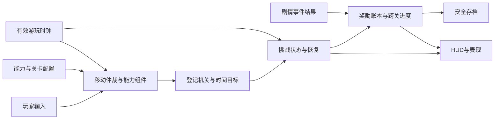

# Tripo 项目开发执行方案

当前控制已按最新试玩反馈修正为视角主导、身体跟随，参见[GASP 参考与视角主导控制](./GASP参考与视角主导控制.md)。

整理日期：2026-09-15。依据：开发设计 v0.2、剧情脚本 v0.2。

**职责补充（2026-09-15）：**用户提出由 Codex 承担全部游戏逻辑，美术制作不在其范围内。下文阶段依赖继续适用，原三人分工表作为方案背景。Codex 交付完整可玩灰盒、功能 UI、全部系统与测试；最终模型/贴图/配音制作和赛事材料由团队另行负责。具体工作方式与工具见 [AI 全逻辑开发工具方案](./AI全逻辑开发工作方式与工具选型.md)。

## 1. 方案结论

按“工程基线 → 状态与恢复底座 → 可玩基础闭环 → 全八项能力与进度 → 全剧情灰盒 → 正式关卡和美术 → Windows 交付”推进。

先让规则在基础模型组成的可测试场景中成立，再接入正式布局和模型。八项能力、三级成长、计时奖励、NPC 交换、存档和完整剧情均保留在总范围内；阶段交付用于控制集成风险。

初始目录没有 UE 工程。用户后续授权工具实测和开发后，已在 `game/Tripothon.uproject` 建立正式工程，已完成完整逻辑灰盒、连续教程及 Windows Development/Shipping 构建。最新状态见 [开发进度](./开发进度.md)，具体工具选择与验证见 [工具实测报告](./工具实测报告.md)。

### 资料口径

| 类别 | 本方案如何处理 |
|---|---|
| 原文记载的已确认项 | 沿用为规划基线，不擅自缩减或改写 |
| 原文明确标注的建议默认 | 作为待实施草案，数值和操作细节通过试玩校准 |
| 本次整理建议 | 用于分阶段、补足依赖与明确验收，不冒充原始要求 |
| 缺失资料和未验证实现 | 明确列为待补齐或未验证，不写成已完成 |

## 2. 产品目标与范围

### 2.1 规划基线（原文记载）

- UE5.7、Windows 单机、第三人称有限旋转镜头。
- 卡通圆润风格，以尺度变化和空间连接营造梦核氛围；保留需要练习的跳跃与技能操作。
- 小孩进入后室，重游家、学校和曾与网友游玩的 Minecraft 原地图，进入未来公司，最终发现这是未来自己寄来的礼物。
- 限时到达终点可自选 BUFF，超时完成则随机；能力同类升级，初、中、高三级；提供 NPC 交换。
- 三人分别负责引擎开发、策划关卡、建模；先完成全部逻辑灰盒，正式地形由关卡同学设计。

Minecraft 一幕必须保留“主角原先那张地图”的身份。没有原图参考时使用标注清楚的占位地标；歪屋顶、路牌与合影示例不能当作已经证实的共同经历。

### 2.2 完整交付范围

角色与镜头、八项能力、可配置机关、挑战计时、奖励账本、三级成长、NPC 交换、检查点与重开、安全存档、章节推进、剧情与收藏、HUD/菜单、结尾驻足与独立练习、LogicLab、连续教学关、正式内容和 Windows 包。

原设计未纳入联网、战斗、怪物 AI、完整体素编辑、生存合成、商店经济、全世界倒带等系统。

### 2.3 建议默认（可调，需同步规则和用例）

| 事项 | v0.2 默认 |
|---|---|
| 等级 | 0 为未获得，1–3 为三级；同类奖励 +1；本轮故事跨关保留 |
| 基础能力 | 教学节点取 `max(现有等级, 教学下限)`；起跑仅校验 |
| 奖励时限 | 每个挑战单独配置；超时仍能通关，不剥夺结尾 |
| 加时能力 | 被动，起跑读取并锁定；5/10/15 秒仅为调试建议 |
| NPC | 安全区一等级换一等级，保护当前及下一已声明挑战下限 |
| 死亡与重开 | 普通掉落计时继续；主动重开未结算挑战重新计时 |
| 存档 | 安全点落盘；关内检查点先用内存快照 |
| 分身 | 回放自己的冻结历史；一次最多一个；自身回溯先取消分身 |
| 结尾 | 揭晓、寄回卡片、继续驻足；练习进度与正式成长隔离 |

## 3. 剧情与能力落点

章节顺序沿用脚本建议。章节不等于地图，也不限制一章只有一个挑战；挑战数量与地形由策划配置。

| 段落 | 可玩内容与能力教学 | 剧情/验收重点 |
|---|---|---|
| 序幕 | 移动、交互、打开礼盒；无挑战钟 | 原地图地标先在屏幕出现；开盒与转场只生效一次 |
| 家 | 普通跳跃、平面位移、上位移；首个计时组合 | 玩具车细节埋线；先练习再起跑 |
| 学校 | 蹬墙跳、局部减速；移动机关 | 明确机关变慢但挑战钟不变；屏幕连接旧地图 |
| Minecraft | 垫脚石、动作分身；旧路线与双人机关 | 三类地标形成认图依据；网友投影无机关权限 |
| 未来公司 | 自身/机关时回、奖励加时、最终组合 | 家、学校、旧图的线索汇合；最低能力路线可过 |
| 终幕 | 揭晓、回信卡、收藏与练习入口 | 可跳过录音；恢复控制；重玩不重复领奖 |

长对白、技能说明、合影与揭晓放在未计时或已结算区域。34 个剧情事件已落地到 DA_Story、剧情子系统和教程触发区域。

## 4. 技术结构与职责

沿用开发分册的设计选择；具体 API、模块和构建命令须在 T00 接入真实 UE5.7 工程后核查。本节描述拟建架构。

| 层 | 责任 | 主要交付 |
|---|---|---|
| 角色、移动、镜头 | 单一位移仲裁，输入路由，有限镜头和遮挡 | Character、MovementComponent、Controller/相机层 |
| 能力 | 等级参数、条件、激活/取消、冷却、失败原因 | AbilityComponent、受其更新的能力实例、AbilityDefinition |
| 时间 | 有效游玩时钟、局部机关速率、有界历史 | 时间基座、TimeAffectable、TemporalHistory |
| 交互机关 | 显式信号、触发者权限、状态快照与恢复 | Interactable / Resettable / TemporalTarget 接口及实例 |
| 当前世界挑战 | 挑战状态、计时、机关注册、恢复事务 | World 范围 ChallengeSubsystem |
| 跨关进度 | RunId、种子、等级、奖励账本、剧情与安全存档 | GameInstance 范围 RunSubsystem |
| 配置与表现 | 挑战/章节/奖池/地标数据，蓝图装配，HUD 订阅 | DataAsset、表现蓝图、UI |

固定八项技能默认使用轻量组件；若实际工程已有稳定 GAS 则复用。编辑器工具独立于运行时，使用与否不影响独立包运行。

代码目录按 Player、Abilities、Temporal、Interaction、Challenge、Progression、Narrative、UI 划分即可。实际模块名沿用工程；不要因文档使用 `Gift` 示例名而重命名现有项目。

## 5. 必须先稳定的规则

### 5.1 时间与奖励

- `ActionClock` 是排除显式暂停的单调游玩时间；能力减速不改变它。暂停恢复不能补算暂停时长。
- `ChallengeClock` 从起跑时间推导；普通死亡和自身回溯不倒退它。
- 机关通过自身局部速率推进；历史游标倒退只改变允许恢复的运动字段。
- `有效预算 = 挑战基础预算 + 起跑时加时等级对应增量`。
- 终点立即冻结完整精度完成时间；`完成耗时 <= 有效预算` 为自选，越界为随机。HUD 显示 0 不作为判定依据。
- 超时只通知资格变化；到终点再结算。自选默认展示全部有效候选，随机按有效权重抽取。
- 奖励提交键为 `RunId + ChallengeId`。稳定种子由 RunSeed 和 ChallengeId 派生；结算候选生成一次并缓存，重开 UI 不重抽。
- 满级/空池有完成兜底；保存失败显示未保存，保留可重试状态。

### 5.2 恢复与持久化

| 项目 | 普通死亡 | 主动重开未结算挑战 |
|---|---|---|
| 位置与机关 | 最近安全检查点及其快照 | 挑战起点及开局快照 |
| 计时 | 继续，包含死亡恢复过程 | 重新起跑 |
| 冷却 | 不刷新 | 恢复挑战开始值 |
| 已提交奖励与等级 | 保留 | 保留已提交进度，不能回滚账本 |
| 临时对象 | 清理石块、分身、减速源 | 同左 |
| 历史与旧事件 | 清空并更新 epoch（本次状态代次） | 同左；随机种子保留 |

统一恢复顺序：锁技能与交互 → 取消活动能力并清理临时物/占用 → 恢复机关显式快照 → 校验安全出生点并恢复玩家 → 清旧事件和历史、更新 epoch → 重算重叠条件 → 恢复输入。检查点不能依赖即将清理的石块支撑。

存档保存稳定 ID 与数据，不保存跨地图 Actor 指针。记录版本，校验损坏/旧数据；异步保存使用不可变快照。退出未结算挑战后，从最后安全存档重新开始，菜单说明这一行为。

### 5.3 剧情与通关能力

- `Viewed`（看过表现）与 `Applied`（结果已应用）分开；跳过对白仍授予必要能力、恢复出口。
- 教学授予取最大值，不能重复进入就 +1；挑战起跑不隐式补发能力。
- NPC 原子交换，取消无扣除，连续点击不重复提交；不能换走最低通关能力。
- 每章出口由要求挑战集合的已提交结果推导；可选收藏默认不锁主线。
- 技能分身只影响允许 Echo 的机关；网友记忆投影仅有表现权限。
- 最低配置通关必须实际试玩，配置校验只能发现明显缺项。

## 6. 八项能力的开发与验收

所有能力均需 0–3 级配置、有效反馈、失败原因与清理路径。距离、速度、持续时间和冷却均是待试玩参数。

| 能力 | 实现重点 | 必测失败与组合 |
|---|---|---|
| 平面位移 | 水平输入方向、带碰撞移动、每腾空周期次数 | 撞墙提前停止；冷却到期不提供无限空中冲刺 |
| 上位移 | 统一移动组件施加上冲，碰顶终止 | 长按不逐帧叠速；与冲刺不抢 Transform |
| 蹬墙跳 | 允许墙面、法线、墙面接触记录 | 同墙重叠抖动不无限刷新；与冲刺组合 |
| 垫脚石 | 放置预览、范围/重叠检查、数量与寿命 | 非法放置不耗费；上限不静默删脚下石块；死亡清理 |
| 局部减速 | 登记机关、自有相位、多来源取最小倍率 | 冷却/奖励钟不慢；来源销毁后不永久减速 |
| 时回 | 有界时间戳历史、自身与标记机关、路径碰撞 | 不能穿关闭的门；移动基座失效安全退出；不回退等级/奖励/冷却/空中消耗 |
| 分身 | 创建时冻结回放片段，事件按时序与 ID 去重 | 不能领奖/交易；销毁释放压力板；当前目标距离与屏障校验 |
| 增加奖励时间 | 起跑读取被动等级并锁预算 | 交换不刷新运行中的挑战钟；超时不恢复自选资格 |

## 7. 阶段计划与任务依赖

沿用 T00–T21 共 22 项任务。T20/T21 按依赖插入，不能按编号顺排。以下描述各任务计划和验收要求；实际完成状态独立记录在 [开发进度](./开发进度.md)，不把规划文本当成已实现功能。

### M0：工程与可运行基线

- **T00**：定位真实工程、引擎、模块、插件、版本管理及已有功能，完成完整构建和最小 Windows 包。
- 交付：工程与构建入口、日志、独立启动证据、已实现/待实现清单。
- 门槛：能复现构建并在未开编辑器时启动。资料整理完成不等于 T00 完成。

### M1：操作、状态、交互与恢复底座

| 任务 | 原前置 | 核心产物 |
|---|---|---|
| T01 角色与有限镜头 | T00 | 基础移动、跳跃、相机区域与输入验证 |
| T02 状态标识与时间基座 | T00 | 稳定 ID、暂停原因、时钟、恢复状态与日志 |
| T03 技能生命周期 | T01、T02 | 八项定义、等级、激活/取消、冷却及失败反馈 |
| T04 机关与复位接口 | T02 | 压力板、开关、条件汇聚、门、平台与注册 |
| T05 检查点与恢复 | T01、T04 | 死亡/重开、快照、安全出生与 epoch 清理 |

门槛：灰盒中能移动、踩板开门、掉落恢复；重复重置不丢输入、不留机关脏状态。Lab 在此阶段开始随功能增长。

### M2：基础可玩闭环与空间能力

| 任务 | 原前置 | 核心产物 |
|---|---|---|
| T06 计时与奖励事务 | T02、T03、T05 | 起终点、自选/随机、稳定种子、账本与兜底 |
| T07 三项空间移动 | T03、T05 | 平面位移、上位移、蹬墙跳的真实玩法 |
| T08 垫脚石 | T03、T04、T05 | 放置、到期与恢复清理 |

门槛：安全出生 → 跳跃/位移 → 踩板开门 → 起跑 → 掉落恢复且计时继续 → 到终点结算 → 重复触发不双领。用基础文字 UI 先验证结果；完整 UI 留到 T14。

本阶段奖励账本先验证内存内的一致性；退出重进与可靠落盘必须到 T13 验收。原文首个闭环提到的“安全区保存”不可在尚无 T13 时标为完成。

### M3：时间能力、成长与持久化

| 任务 | 原前置 | 核心产物 |
|---|---|---|
| T09 局部减速 | T02、T03、T04 | 来源句柄与可控机关局部推进 |
| T10 时回与有界历史 | T03、T05、T09 | 自回/机关回溯、安全路径、未来分支裁剪 |
| T11 分身 | T04、T05、T10 | 冻结回放、Echo 权限、占用清理 |
| T12 三级成长、NPC、加时 | T03、T06 | 等级事务、保护下限、起跑预算 |
| T13 安全存档与转场 | T05、T06、T12 | 版本、RunSeed/账本、继续与跨图绑定 |
| T14 HUD 与菜单 | T01、T06、T12、T13 | 奖励/NPC/暂停/新游戏/继续的焦点闭环 |

**依赖补充建议：**T12 的等级与交换框架可在 T03/T06 后开发，但“八项能力升级效果全部接通”的最终验收，还应等待 T07–T11 的能力实现。把框架可开发与整项可验收分开记录，避免空能力通过成长验收。

门槛：八项能力各三级真实可用；减速/回溯不改变奖励钟；退出重进不双领；交换不造成能力软锁；菜单关闭恢复输入。

### M4：剧情与全逻辑灰盒

| 任务 | 原前置 | 核心产物 |
|---|---|---|
| T15 剧情与结束驻足 | T04、T13、T14 | 34 事件映射、Viewed/Applied、章节集合、练习隔离 |
| T20 Minecraft 记忆接口 | T11、T15 | 地标、留言、投影、合影、出口及权限验证 |
| T16 Lab 与回归矩阵 | T07–T12、T14、T15、T20 | A–M 验证区、综合跑道、真实回归记录 |

门槛：缺配音与正式模型仍能贯通剧情；跳过不漏授予；投影开关不影响通关；能力与奖励/恢复组合通过验证。Lab 的占位识别测试不等于正式原地图复原验收。

### M5：连续教学、正式内容与发布准备

| 任务 | 原前置 | 核心产物 |
|---|---|---|
| T17 连续教学关 | T16 | L_Tutorial、最低能力路线、正式章节布局与挑战配置 |
| T18 美术替换 | T16 | 角色骨骼/动画适配、代表资产与全流程替换回归 |
| T21 提交与素材核对 | T18 | 赛事手册条目、资产来源、使用范围与待处理项 |

关卡草搭、原图参考收集、模型样件可提前进行；上表前置约束最终整合验收。正式章节装配作为 T17 的交付子项明确追踪，避免只交 Lab/Tutorial 就宣称完整游戏完成；全批次资产替换也不能仅由代表样件测试代替。

门槛：最低合法配置贯通正式流程；Minecraft 三类确认地标保留；替换不改变碰撞/触发/安全点；公开提交所需资料核对有结论。

### M6：Windows 最终交付

- **T19**，前置 T17、T18、T21：完整构建、Cook/打包、资源加载、无编辑器启动、完整通关、存档、异常恢复与性能记录。
- 1080p/60fps 沿用原文作为待验证目标，必须绑定实际测试设备与画质；30/60/120fps 封顶用于规则一致性测试。
- 交付：运行包、构建/版本说明、操作说明、测试证据、已知问题和素材清单。明确包所在路径与启动入口。
- 缺少赛事或素材依据时，内部包可继续技术测试，公开提交验收保持未完成。

### 排期方法（本次建议）

不填未经依据的发布日期。T00 后按现有代码重估剩余任务；M2 后用实际移动手感与组件装配速度评估关卡工作量；T10/T11 后复核时间系统风险。三人分别给出工作量和可投入时间，再形成日历计划。阶段目标以验收证据为准。

## 8. 三人协作与交付接口

| 负责人 | 首批工作 | 持续交付 | 验收依据 |
|---|---|---|---|
| 引擎开发 | 工程基线、角色、时间与恢复 | 能力/机关、数据字段、Lab、存档、构建包 | 可摆放示例、配置说明、失败提示、复位与测试 |
| 策划关卡 | 章节挑战草图、原图参考、最低能力路线 | 相机锚点、时限、起终点、奖池、事件绑定 | 最低配置通关记录与正式地图接线 |
| 建模 | 代表角色/邮差样件、地标样件 | 模型、骨架/动画、材质、来源记录 | 尺寸/原点/前向一致；替换后玩法不变 |

关卡交付最小字段：ChapterId、要求挑战集合、ChallengeId、起终点、奖励预算、GuaranteedAbilityLevels、奖池、安全检查点、ResetGroup、机关初始状态、EventId、CameraAnchor。Minecraft 另交 LandmarkId、参考依据、方位关系、必须保留细节与允许加建区域。

模型交付最小字段：尺寸单位、原点、前向、缩放、材质槽、贴图、碰撞需求、骨架/动画来源、最终路径、来源与使用状态。模型挂在视觉子节点，玩法碰撞独立配置。

同一地图/蓝图同一时段由一人写入；构建串行。每批功能或资产合入后复测受影响的 Lab 区和正式路线。规则变更同步配置、文档与用例，稳定 ID 变更需评估存档迁移。

## 9. 测试与完成标准

### 9.1 分层验证

| 层级 | 覆盖内容 | 证据 |
|---|---|---|
| 规则自动化 | 时间边界、等级/权重、稳定随机、事务去重、交换 | 测试结果、失败原因、日志 |
| UE 场景功能测试 | 碰撞、机关联动、销毁清理、恢复、转场 | 地图与配置、步骤、结果 |
| 数据校验 | 重复 ID、空引用、非法等级/预算、缺起终点/下限 | 资产校验报告 |
| 人工试玩 | 操作难度、镜头落点、逐步教学、最低配置路线 | 能力配置、路线录像/记录、问题 |
| 独立包 | Cook 资源、菜单/存档/全流程、设备表现 | 包版本、设备/画质、日志与结果 |

### 9.2 首批高风险用例

1. 恰好时限、略早/略晚到达的资格一致，不受 HUD 取整和 Tick 顺序影响。
2. 终点抖动、奖励 UI 反复开关、重复回调不双领、不重抽。
3. 满级奖池、空池、非法权重都有明确结果，不锁流程。
4. 普通死亡计时继续；主动重开重新计时且种子不变；冷却按各自规则恢复。
5. 减速来源按不同顺序结束、目标销毁、重置后无永久减速。
6. 回溯遇关门、墙体、移动基座失效和历史不足安全结束；不恢复奖励等禁止字段。
7. 分身销毁释放压力板；跨帧多个回放事件不丢不重；网友投影不能踩板。
8. NPC 取消/连点不扣错，保护当前和下一挑战下限，加时只在起跑锁定。
9. 暂停/失焦恢复不补时；奖励、NPC、对白关闭后恢复焦点。
10. 跳过/重进教学不漏授予也不重复升等；读档重建出口；练习不刷成长。
11. 保存失败有反馈并保留上次可用存档；未结算退出后按说明恢复。
12. 30/60/120fps 下移动、回放与计时规则一致；软引用资源在包中实际可加载。

### 9.3 完成定义

每项任务必须同时有实现、配置入口、可运行灰盒、正常/失败/复位验证、构建日志和已测/未测报告。只生成类、只编译通过、只有文档或工具调用成功都不足以标记完成。

原文提及 88 条用例，但当前没有 `qa_cases.json`，无法逐项核查。本节是优先覆盖清单，不声称重建或执行了原来的 88 条用例。后续状态使用 NotRun / Pass / Fail / Blocked，并记录构建版本、配置、预期、实际与证据。

## 10. 缺口、风险与处理顺序

| 缺口/风险 | 影响 | 处理与负责人 |
|---|---|---|
| 未接入真实 UE 工程 | 无法确认已有进度、API、构建入口 | 开发在 T00 定位；若无工程再确定新建位置与模块名 |
| 配套 ZIP、数据、模板、工具缺失 | 无法直接导入参数或沿用完整测试集 | 开发/策划补齐原包；无法取得时按分册重建并标明来源，不臆造缺失数值 |
| 八项能力精细数值与键位未定 | 手感、关卡尺度无法冻结 | 开发提供可调参数，策划通过 M2/M3 试玩校准 |
| 挑战数量、预算与章节时长未定 | 正式内容工作量和排期不确定 | 策划按最低配置路线实测填写，空预算不能进正式验收 |
| 原地图资料缺失 | 无法验收“那张旧地图” | 策划收集地图/截图/地标关系；灰盒占位可先行 |
| 时间系统互相影响 | 穿门、刷奖励、残留占用、恢复锁死 | 开发统一时间和事务所有权；T10/T11 及组合回归优先 |
| 资产替换改变碰撞或漏 Cook | 灰盒可过但正式包失败 | 建模与开发分离逻辑/视觉，每批替换后独立包抽查 |
| 赛事手册、素材使用范围待核对 | 公开提交条件无法确认 | 团队指定提交负责人；资料收集提前，T21 汇总验收。本次不作授权判断 |
| 目标设备和可投入时间不明 | 性能承诺与日期无依据 | 团队在工程基线后确定，按实测更新预算 |

## 11. 下一次研发的具体入口

1. 定位团队实际 `.uproject` 和 UE5.7 安装路径，确认是否存在已有源码、地图、插件和版本管理。
2. 获取配套 ZIP；若无法取得，先补 T00 所需记录，再按当前任务逐步重建配置与用例。
3. 执行 T00，留下完整构建、最小包和独立启动证据；保留现有实现与未提交改动。
4. 基线通过后执行 T01/T02，再推进 T03/T04/T05；每项交付包含可使用示例。
5. 策划同时准备家中首段路线与 Minecraft 三类地标参考，建模准备一个角色/机关外观替换样件。

详细规则查阅 [开发设计分册](./Tripo_UE57_开发方案_v0.2.md)，对白与事件落点查阅 [剧情脚本](./Tripo_剧情脚本_v0.2.md)。
